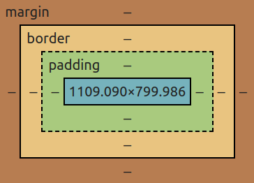

# CSS

- **Cascading Style Sheets (Folhas de Estilo em Cascata);**
- **Não é uma linguagem de programação;**
- **Linguagem de estilo/de estilização;**
- **Utilizada em conjunto com o HTML;**
  - **Utiliza-se para criar o _layout_ do site (pela parte estética da página);**


### Formas de adicionar CSS

- **Inline CSS: quando adicionamos os estilos diretamente no elemento HTML, na tag, através do atributo `style` (isso é considerado uma má prática);**
- **CSS Interno (Internal): quando aplicamos os estilos por meio da tag <style>, no próprio documento HTML (a tag <style> fica dentro da tag <head>);**
- **CSS Externo (External): quando importamos um arquivo de extensão `.css`, no arquivo HTML (forma mais indicada);**


### Sintaxe

- **Para estilizar os elementos, temos que:**

  - **Selecionar o elemento (pelo nome da tag/classe/`id`);**

  - **Abrir e fechar chaves (corpo onde serão inseridos os estilos para aquele elemento selecionado);**

  - **Definir os estilos (as regras devem termina com um ponto e vírgula);**

    ```css
    elemento/seletor {
        propriedade: valor; /* Regra de estilização */
    }
    ```

    

### Seletores CSS

```css
/* Seletores: forma de selecionar elementos HTML para a aplicação de estilos */

p {
    border: 1px solid blue;
    
    color: red;
}

/*
	- p: seletor (tag);
	- border && color: propriedades;
	- red && 1px solid blue: valores;
*/
```

- **Também temos:**

  - **Seletores de classe: utilizam os atributos de `class` aplicada nos elementos HTML (que podem ser adicionadas em vários elementos HTML), o que permite a seleção de mais de um elemento (os estilos aplicados afetam todos os elementos que possuem determinada classe);**

  - **Seletores de `id`: que utilizam o atributo `id` (que deve ser adicionado a um único elemento HTML - pode ser adicionado a mais de um elemento, mas não é o indicado), permitindo a seleção de um único elemento (os estilos afetam um único elemento);**

    ```css
    /* Seletor de tag */
    nome_da_tag {
        propriedade: valor;
        .
        .
        .
    }
    
    /* Seletor de classe */
    .classe {
        propriedade: valor;
        .
        .
        .
    }
    
    /* Seletor de id */
    #id {
        propriedade: valor;
        .
        .
        .
    }
    ```

#### Tipos de seletores

- **Seletor universal (`*`): seleciona todos os elementos do arquivo HTML;**
- **Seletores de tipo: quando selecionamos os elementos HTML, a partir das tags;**
- **Seletores de classe: quando o elemeto HTML é selecionado a partir da sua classe;**
- **Seletores de `id`: quando selecionamos o elemento HTML a partir do seu `id`;**
- **Pseudo-classes: quando selecionamos um elemento a partir do seu estado. Ex.: `:hover`;**
- **Pseudo-elemento: quando selecionamos uma parte específica de um elemento. Ex.: `::first-line`/`first-letter`;**
- **Seletores de atributo: quando selecionamos um elemento, que possue um atributo específico. Ex.: `input[type="text"]`;**

#### Combinação de seletores (outros tipos de seletores)

- **`A + B` (seletor adjacente): seleciona o elemento que vem logo após o primeiro elemento (no caso do exemplo dado, seleciona o elemento B que vem logo após o elemento A);**
- **`A > B` (seletor descendente): seleciona todos os elementos filhos diretos do primeiro elemento (todos os elementos B, filhos diretos do elemento A);**
- **`A ~ B` (elemento irmão): seleciona todos os irmãos (de mesmo nível e que venham após) diretos do primeiro elemento (todos os elementos B, irmãos diretos de A);**
- **`A[contexto]`**
  - **A[alt]: seleciona todos os elementos A, que possuem o atributo `alt` definido;**
  - **`A[href="link"]`: seleciona todos os elementos A, que possuem o _link_ determinado;**
  - **`A[href*="trecho"]`: todos os elementos A que possuem o trecho especificado no _link_;**
  - **`A[href^="inicio"]`: todos os elementos A com _link_ que são iniciados como trecho informado;**
  - **`A[src$="final"]`: todos os elementos A que posseum o trecho informado no final;**


### Especificidade

- **Define qual conjunto de estilos tem prioridade sobre os outro;**

  - **Quando temos diferentes regras CSS, que apontam para um mesmo elemento (regras conflitantes), qual o navegador irá aplicar?**

- **Seletores mais específicos (do maior, para o de menor peso):**

  - **0 - estilos _inline_ (apresenta o maior peso) ;**
  - **1 - `ids` (peso médio);**

  - **2 - classes, atributos e pseudo-classes (peso baixo);**

  - **3 - tags (seletores de tipo) e pseudo-elementos (peso mais baixo);**

- **Regras a serem observadas:**

  - **Para regras conflitantes, a regra de maior peso acabará sendo aplicada;**

    ```css
    /* <h1 id="h1" class="heading-1">Título 1</h1> */
    
    #h1 {
      color: green; /* Cor a ser aplicada */
    }
    
    .heading-1 {
      color: red; 
    }
    ```

  - **Se as regras tiverem o mesmo peso, a última será aplicada (a que vem mais abaixo);**

    ```css
    /* <h1 class="h1 heading-1">Título 1</h1> */
    
    .h1 {
      color: green;
    }
    
    .heading-1 {
      color: red; /* Cor a ser aplicada */
    }
    ```

  - **Regras que apresentam seletores de mesmo peso, por exemplo, em uma regra temos dois seletores de classe, o peso referente a esse seletor será contado duas vezes;**

    ```css
    /* <h1 class="h1 heading-1">Título 1</h1> */
    
    .h1 {
      color: green; 
    }
    
    .heading-1 {
      color: red; 
    }
    
    .h1.heading-1 { /* Peso 2x */
      color: blue; /* Cor a ser aplicada */
    }
    ```

  - **Seletores com o peso maior, sempre irão prevalecer em relação a seletores de peso menor, não importando a quantidade desses seletores de menor peso:**

    ```css
    #id {
        color: green; /* Cor a ser aplicada */
    }
    
    .classe1.classe2.classe {
        color: red;
    }
    ```

  - **OBS.: o seletor universal e os combinadores (`>`, `~`, `+`), não alteram os pesos dos seletores;**

#### A regra `!important`

- **Utilizando a regra `!important`, conseguimos ignorar a especificidade dos seletores (independente do peso/ordem de importância do seletor, aquele que tiver a regra `!important`, terá o seu conjunto de estilos aplicado);**

  ```css
  /* <h1 id="h1" class="heading-1" style="color: yellow">Título 1</h1> */
  
  h1 {
      color: red !important; /* Cor a ser aplicada */
  }
  
  #h1 {
      color: green; 
  }
  
  .heading-1 {
      color: blue;
  }
  ```

- **Não é recomendado o uso da regra `!important`, já que ela pode deixar a manutenção de código difícil;**
- **Quando temos mais de uma regra que apresentam o `!important`, passa a valer a questão da ordem de importância dos seletores (o que acaba fazendo com que o uso do `!important` não tenha muito sentido);**


### Box-model

- **Tudo no CSS é uma caixa (um container);**

  - **E essa caixa, ou esse container,envolve cada elemento HTML;**

  - **Essa caixa é conhecida como _box-model_;**

    


- **Essa caixa consiste em: margens (`margin`), bordas (`border`), preenchimentos (`padding`)  e o conteúdo em si (`content`);**



#### Box-sizing

- **Propriedade que nos permite incluir as dimensões de preenchimento (`padding`) e de borda (`border`), na altura e largura total de um elemento;**

  - **Por padrão, altura e largura, de um elemento, são calculados da seguinte maneira:**

    ```markdown
    largura + preenchimento + borda = largura total de um elemento
    altura + preenchimento + borda = altura total de um elemento
    
    |-> Isso faz com que o elemento geralmente pareça maior do que aquilo que foi definido (borda e preenchimento são adicionados a altura e a largura do elemento);
    ```

  - **Valores:**

    - **`box-sizing: content-box;`:  valor padrão (mantém o comportamento padrão - adiciona os valores de preenchimento e borda, na altura e largura final do elemento );**
    - **`box-sizing: border-box;`: inclue os valores de preenchimento e borda, na altura e na largura final do elemento;**


### Unidade e Tamanhos

- **O CSS possue diferentes unidades para expressar um comprimento/tamanho;**

- **Existem dois tipos de unidade de comprimento:**

  - **`absoluto`: são unidades fixas (quando definidas, permanecem exatamente com aquele tamanho, por isso não são recomendadas, já que o tamanho da tela varia);**

    - **`cm`: centímetros (1 cm = 37.8 px = 25,2/64 in);**
    - **`mm`: milímetros (1mm = 1/10 de 1cm);**
    - **`in`: polegadas (1in = 2,54cm = 96px);**
    - **`pc`: paica (1pc = 1/6 de 1in);**
    - **`pt`: point (1pt = 1/72 de 1in);**
    - **`px`: pixels (1px = 1/96 de 1in);**

  - **`relativo`: especificam um tamanho/comprimento, relativo a outra proprieadade de tamanho/comprimento (seja do elemento pai ou o tamanho da _viewport_ - o tamanho da janela de visualização/a área visível da página) - simplificando, são calculadas tendo como base, uma outra unidade definida. São mais recomendáveis para se ter _layouts_ escaláveis;**

    - **`em`: relativa ao tamanho da fonte (`font-size`) do elemento pai (`2em` por exemplo, indica 2 vezes o tamanho da fonte do elemento pai). Para outras propriedades como a largura (`width`), se torna relativa a ao tamanho da fonte do próprio elemento;**

    - **`rem`: semelhante ao `em`, só que ao invés de ser relativa ao elemento pai, acaba sendo relativa em relação ao elemento raiz (`root`), a tag <html>;**

      ```css
      /*
      	- Valor padrão do font-size do elemento raiz, especificado pelos os navegadores: 16px;
      
      	- Com isso:
      		- .0.5rem = 8px;
      		- 1rem = 16px;
      		- 1.5rem = 24px;
      		- 2rem = 32px;
      		- .
      		- .
      		- .
      
      	- Base para 16px (outros valores):
      		- 10px = 0.625rem;
      		- 12px = 0.75rem;
              - 14px = 0.875rem;
              - 18px = 1.125rem;
      */
      
      /* Para nos ajudar, podemos utilizar seguinte truque: */
      html{
          font-size: 62,5%;
      }
      
      h1{
          font-size: 1.2rem;  /*equivalente a 12px*/
      }
      
      p{
          font-size: 2.4rem; /*equivalente a 24px*/
      }
      ```

    - **`%` (porcentagem): relativa ao tamanho/comprimento do elemento pai (consiste sempre na fração de algum outro valor);**
    - **`vw` (_viewport width_): relativa a largura da _viewport_ (`1vw` representa 1% do tamanho da largura visível);**
    - **`vh` (_viewport width_): relativa a largura da _viewport_ (`1vw` representa 1% do tamanho da largura visível);**
    - **Outros tipos de unidade: `ex`, `ch`, `vmin`, `vmax`;**

  - **OBS.: quanto utilizamos a unidade `vw`, ela não da conta da barra de rolagem;**

#### Trabalhando com `px`, `rem` e `em`

**1º - definir o `font-size` do elemento raiz em `px`;**

**2º - definir os "elementos pai" (os elementos mais externos), com o `rem`;**

**3º - definir os "elementos filho" (os elementos mais internos), com o `em`;**


### Cores

- **Podem ser adicionadas a um elemento HTML, de diferentes formas:**

  ```css
  /* Nome */
  p {
     color: red;
  }
  
  /* Código hexadecimal */
  p {
     color: #FF0000;
  }
  
  /* Sistema RGB */
  p {
     color: rgb(255, 0, 0);
  }
  
  /* Sistema RGBA */
  p {
     color: rgb(255, 0, 0, 0.5);
  }
  ```

  - **`color`: aplica uma cor ao texto;**

- **RGB**

  - **`rgb(red, green, blue)`;**
  - **Cada parâmetro define a intensidade de cor entre 0 e 255;**
  - **Vermelho: `rgb(255, 0, 0)`;**
  - **Verde: `rgb(0, 255, 0)`;**
  - **Azul: `rgb(0, 0, 255)`;**
  - **Preto: `rgb(0, 0, 0)`;**
  - **Branco: `rgb(255, 255, 255)`;**
  - **Tons de cinza (geralmente apresentam os mesmos valores para os três parâmetros):**
    - **`rgb(60, 60, 60)`**
    - **`rgb(120, 120, 120)`;**

- **RGBA**

  - **Extensão dos valores RGBA;**
    - **O a vem de _alpha_ (alfa), um canal, que especifica a opacidade da cor;**
    - **Esse canal alfa corresponde a um valor entre 0.0 e 1.0;**

- **Hexadecimal**

  - **#RRGGBB**

    - **RR (Red - Vermelho);**
    - **GG (Green - Verde);**
    - **BB (Azul - Blue);**
    - **Especificam os componentes da cor;**

  - **RR, GG e BB são valores hexadecimais entre 00 e FF;**

    - **Vermelho: `#FF0000`;**

    - **Verde: `#00FF00`;**

    - **Azul: `#0000FF`;**

    - **Preto: `#000`/`#000000`;**

    - **Branco: `#FFF`/`#FFFFFF`;**

    - **Tons de cinza (geralmente apresentam os mesmos valores para cada componente):**

      **- `#FAFAFA`**

      **- `#3C3C3C`;**

  - **Podemos especificar o código hexadecimal com apenas 3 dígitos, que é uma abreviação para o código de 6 dígitos. Esse código possui o seguinte formato:**

    - **`#RGB` - onde cada letra representa um componente (vermelho, verde e azul, ambos com valores entre 0 e F);**

    - **Esse tipo de código hexadecimal só pode ser utilizado quando ambos os valores de cada componente, são iguais entre si. Por exemplo:**

      **- `#FFCC99` = `#FC9`;**

      **-`#FF00FF` = `#F0F`;**

- **HSL**

  - **hsl(hue, saturation, lightness);**
    - **h  (matiz/tonalidade) - um ângulo na roda de cores de 0º a 360º (vermelho - 0, verde - 120 e azul 240);**
    - **s (saturação) - é a intensidade de uma cor e corresponde a um valor percentual (tom de cinza - 0% e cor total - 100%) ;**
    - **l (luminosidade) - pode ser vista como o quanto de luz queremos aplicar na cor e também é um valor percentual (preto - 0%, normal - 50% e branco - 100%;**

- **HSLA**

  - **Extensão dos valores HSL, onde o A (Alpha - Alfa) representa o canal alfa, que especifica a opacidade da cor (semelhante ao sistema RGBA);**
  - **Totalmente transparente: 0.0;**
  - **Totalmente visível: 1.0;**


### Background

- **`background`: utilizada para adicionar efeitos de plano de fundo aos elementos;**

  ```css
  .bg {
      background-color: #FFF;
      
      background-image: url(./image.png);
      
      background-repeat: no-repeat;
      
    	background-position: center;     
  }
  
  /* shorthand, exs.: */
  .bg {
      background: #FFF url(./image.png) no-repeat center;
  }
  
  .bg {
      background: repeat-y right center url("./image.jpg"), no-repeat linear-gradient(to left, #F0F8FF, #FFF);
  }
  ```
  
  - **`background-color`: aplica uma cor de fundo para o elemento;**
  
    - **`background-color: transparent;`: valor padrão;**
  
  - **`background-image`: aplica uma imagem de plano de fundo de um elemento;**
  
    - **Por padrão, a imagem é repetida para cobrir todo o elemento;**
  
    - **É recomendado sempre definir uma cor de fundo, caso a imagem não seja carregada;**
  
    - **O plano de fundo de um elemento corresponde ao tamanho total de um elemento, incluindo preenchimentos e bordas (sem margens);**
  
    - **Podemos definir múltiplas imagens;**
  
  - **`background-repeat`: repete/não, uma imagem, horizontalmente/verticalmente;**
  
    - **`background-repeat: repeat;`: valor padrão (a imagem é repetida verticalmente e horizontalmente e quando não couber, acaba sendo cortada);**
  
    - **`background-repeat: repeat-x;`: a imagem é repetida apenas horizontalmente;**
  
    - **`background-repeat: repeat-y;`: a imagem é repetida apenas verticalmente;**
  
    - **`background-repeat: no-repeat;`: a imagem não é repetida (exibida apenas uma vez);**
  
    - **`background-repeat: space;`: a imagem é repetida o quanto for necessário, sem apresentar recortes (e o espaço em branco é distribuído uniformemente);**
  
    - **`background-repeat: round;`: a imagem é comprimida/esticada para preencher os espaços, não deixando lacunas;**
  
    - **Dois valores:**
  
      ```css
      seletor {
          background-repeat: no-repeat repeat; /* horizontal | vertical */
      }
      ```
  
  - **`background-position`: especifica a posição da imagem de plano de fundo;**
  
    - **Por padrão, a imagem de fundo é colocada no canto superior esquerdo do elemento;**
  
    - **Valores:**
  
      ```css
      seletor {
      	/* Se apenas uma palavra-chave for especificada, a outra palavra-chave será "center" */    
          background-position: bottom;
          background-position: center;
          background-position: left;
          background-position: right;
          background-position: top;
          
          /* Duas palavras-chave | eixo X e eixo Y */
          background-position: left top;
          
          /* Porcentagem | X% e Y% - Se apenas um valor for especificado, o outro será de 50% */
          background-position: 0% 0%; /* Canto superior esquerdo - Valor padrão */
          background-position: 100% 100%; /* Canto inferior direito */
          
          /* 
          	- Posição | x (horizontal) e y (vertical) - Se apenas um valor for especificado, o outro será de 50%;
          	- Podemos usar qualquer unidade (px, rem, em, etc);
          	- E podemos misturar essas unidades com porcentagem
          */
          background-position: 0 0;
          
          /* Para múltiplas imagens, utilizamos a vírgula para separar os valores */
          background-position: 0 0, top;
      }
      ```
  
  - **`background-attachment`: especifica se a imagem/plano de fundo deve rolar (junto do bloco que a contém) ou ser fixa (não sofrerá o efeito do _scroll_) na _viewport_;**
  
    - **`background-attachment: scroll;`: valor padrão (a imagem de fundo rolará junto com a página, mas não rolará junto com o conteúdo);**
    - **`background-attachment: fixed;`: a imagem de fundo não rolará junto com a página (a imagem de fundo é fixa em relação a _viewport_). E mesmo que o elemento possua um mecanismo de rolagem, a imagem não se move junto com o elemento (ela fica travada em um lugar, mesmo que o restante do documento role);**
    - **`background-attachment: local;`: a imagem de fundo é fixa em relação ao conteúdo do elemento. Agora, se o elemento tiver um mecanismo de rolagem, a imagem de fundo rola junto com o conteúdo do elemento;**
  
  - **`background-size`: especifica o tamanho das imagens de fundo;**
  
    - **`background-size: auto;`: valor padrão (a imagem de fundo é exibida em seu tamanho original);**
  
    - **`background-size: contain;`: redimensiona a imagem de fundo para garantir que a imagem esteja totalmente visível;**
  
    - **`background-size: cover;`: redimensiona a imagem de fundo para cobrir todo o _container_, mesmo que seja necessário esticar a imagem ou cortar um pouco suas bordas;**
  
    - **`background-size: cover;`: redimensiona a imagem de fundo para cobrir todo o _container_, mesmo que seja necessário esticar a imagem ou cortar um pouco suas bordas;**
  
    - **`background-size: valor_em_pixels_ou_em_porcentagem[px | %];`: redimensiona a largura e a altura da imagem de fundo, de acordo com o valor em pixels, especificado;**
  
      **- Se um valor for especificado, o segundo é definido como auto;**
  
      **- Se dois valores forem especificados, o primeiro define a largura e o segundo a altura;**
  
  - **`background-clip`: define até que ponto, o fundo (cor/imagem), deve se estender dentro de um elemento (que pode ser até a caixa de borda, de preenchimento ou de conteúdo);**
  
    ```css
    /*
    	OBS.:
    		- Se o elemento não fort definido com as propriedades background-image/background-color, esta 
    		propriedade só terá efeito visual quando a borda possuir regiões transparentes ou regiões parcialmente 
    		opacas (devido as propriedades border-style e border-image). Caso contrário, a borda mascara a diferença;
    */
    ```
  
    - **`background-clip: border-box;`: valor padrão (o plano de fundo se extende até a borda externa da borda do elemento);**
  
    - **`background-clip: padding-box;`: o plano de fundo se extende até a borda externa do preenchimento (_padding_);**
  
    - **`background-clip: content-box;`: recorta o plano de fundo na borda da caixa de conteúdo;**
  
    - **`background-clip: text;`: recorta o plano de fundo no texto (do primeiro plano);**
  
      ```css
      background-clip: text;
      
      /* A cor do texto deve ser transparente */
      color: transparent;
      
      /* Para o casa de suporte em navegadores, como o Chrome, por exemplo */
      -webkit-background-clip: text;
      
      /* 
      	Também podemos utilizar outra propriedade de cor de texto, prefixada, que pode 
      	substituir a propriedade color; 
      */
      -webkit-text-fill-color: transparent;
      
      /*
      	OBSs.:
      		1 - A usar esta propriedade, devemos verificar a taxa de contraste entre a cor de fundo 
      		e a cor de texto, para que ela seja alta o suficiente, para que pessoas com problemas de 
      		visão, consigam ler o conteúdo da página;
      
      		2 - Além disso, devemos define um background-color, para o caso da imagem de fundo não 
      		carregar, o que pode tornar o texto ilegível;
      */
      ```
  
      
  

### Bordas

- **`border`: adiciona bordas ao elemento (podemos especificar o estilo, a altura/largura e a cor da borda - _shothand_ para: `border-width`, `border-style` e `border-color`);**

  ```css
  border: largura/altura estilo cor;
  ```

  - **`border-top`: borda somente na parte superior;**

  - **`border-bottom` borda somente na parte inferior;**

  - **`border-left`: borda somente à esquerda;**

  - **`border-right`: borda somente à direita;**
  - **OBSs.: o estilo da borda é obrigatório e se a cor da borda não for fornecida, ela assume a cor do texto;**

- **Outras propriedades relacionadas as bordas:**

  - **`border-style`:  especifica o tipo/estilo da borda (necessária para que o efeito das demais propriedades, possam ser vistos/de fato aplicados);**

    - **`border-top-style`;**
    - **`border-bottom-style`;**
    - **`border-left-style`;**
    - **`border-right-style`;**
    - **_Shorthands_:**

      ```css
      /* 1 */
      border-style: top right bottom left;
      
      /* 2 */
      border-style: top left/right bottom;
      
      /* 3 */
      border-style: top/bottom left/right
      
      /* 4 */
      border-style: top/right/bottom/left
      ```
  - **`border-width`: especifica a largura da borda (nas quatro direções);**

    - **`border-top-width`;**
    - **`border-bottom-width`;**
    - **`border-left-width`;**
    - **`border-right-width`;**
    - **_Shorthands_:**

      ```css
      /* 1 */
      border-width: top right bottom left;
      
      /* 2 */
      border-width: top left/right bottom;
      
      /* 3 */
      border-width: top/bottom left/right
      
      /* 4 */
      border-width: top/right/bottom/left
      ```
  - **`border-color`: define a cor da borda (nas quatro direções);**

    - **`border-top-color`;**
    - **`border-bottom-color`;**
    - **`border-left-color`;**
    - **`border-right-color`;**

      ```css
      /* 1 */
      border-color: top right bottom left;
      
      /* 2 */
      border-color: top left/right bottom;
      
      /* 3 */
      border-color: top/bottom left/right
      
      /* 4 */
      border-color: top/right/bottom/left
      ```
  - **`border-radius`: arredonda os cantos das bordas (nas quatro direções);**

    - **`border-top-left-radius`: arredonda o canto superior esquerdo;**

    - **`border-top-right-radius`: arredonda o canto superior direito;**

    - **`border-bottom-left-radius`: arredonda o canto inferior esquerdo;**

    - **`border-bottom-right-radius`: arredonda o canto inferior direito;**

    - **_Shorthands_:**

      ```css
      /* 1 */
      border-radius: top-left top-right bottom-right bottom-left;
      
      /* 2 */
      border-radius: top-left top-right/bottom-left bottom-right;
      
      /* 3 */
      border-radius: top-left top-right/bottom-left bottom-right;
      
      /* 4 */
      border-radius: top-left/top-right/bottom-right/bottom-left
      ```

      

### Margens

- **`margin`: aplica um espaçamento externo (fora do conteúdo/ao redor do elemento);**

  - **`margin-top`;**

  - **`margin-bottom`;**

  - **`margin-left`;**

  - **`margin-right`;**

- **_Shothands_:**

  ```css
  /* 1 */
  margin: top right bottom left;
  
  /* 2 */
  margin: top right/left bottom;
  
  /* 3 */
  margin: top/bottom right/left
  
  /* 4 */
  margin: top/bottom/right/left;
  ```
  


### Preenchimentos

- **`padding`: aplica um espaçamento interno (dentro do conteúdo/ao redor do conteúdo do elemento);**

  - **`padding-top`;**
  - **`padding-bottom`;**
  - **`padding-left`;**
  - **`padding-right`;**

- **_Shorthands_:**

  ```css
  /* 1 */
  padding: top right bottom left;
  
  /* 2 */
  padding: top right/left bottom;
  
  /* 3 */
  padding: top/bottom right/left
  
  /* 4 */
  padding: top/bottom/right/left;
  ```


### Contorno

- **`outline`: aplica uma linha que fica ao redor do elemento (externa/internamente);**

  - **_Shorthand_ para: `outline-style`, `outline-width` e `outline-color`;**

  ```css
  outline: largura estilo cor;
  ```

  - **Contornam se diferenciam das bordas pelo fato de não ocuparem espaço (eles são desenhados acima do conteúdo do elemento);**

- **`outline-style`: define o estilo do contorno;**

- **`outline-width`: define a espessura do contorno;**

- **`outline-color`: define a cor do contorno;**

- **`outline-offset`: define a quantidade de espaço (a distância), entre o contorno e a borda;**


### Largura e altura

- **`width`: define uma largura para o elemento;**
- **`height`: define uma altura para o elemento;**
- **`max-width`/`max-height`: define uma largura/altura máxima para o elemento;**
- **`min-width`/`min-height`: define uma largura/altura mínima para o elemento;**


### Fontes

```css
p {
    font-family: Helvetica; /* Tipo da fonte */
    
    font-size: 20px; /* Tamanho da fonte */
    
    font-style: italic; /* Estilo da fonte */
    
    font-weight: bold; /* Peso da fonte */
}
```

- **Tamanho padrão: `16px`;**
- **Famílias de fontes genéricas:**
  - **Serifadas (_serif_): apresenta pequenos traços nas bordas de cada letra;**
  - **Sem serifa (_sans-serif_);**
  - **Monoespaçadas (_monospace_);**
  - **Cursivas (_cursive_);**
  - **_Fantasy_;**


### Texto

- **`text-align`: altera o alinhamento do texto;**
- **`text-decoration`: aplica/remove, decoração do texto;**
- **`text-transform`: especifica como captalizar o texto;**
- **`text-indent`: define o recuo da primeira linha de um texto;**
- **`letter-spacing`: aumenta/diminui o espaçamento entre os caracteres;**
- **`line-height`: especifica o espaçamento entre as linhas;**
- **`word-spacing`: especifica o espaçamento entre as palavras;**
- **`white-space`: define como os espaços em branco de um elemento, serão tratados;**


### Display

- **`display`: define o tipo/comportamento de exibição dos elementos, assim como dos seus elementos filhos;**
  - **`display: block;`: o elemento assume o comportamento de um elemento do tipo _block_ (começa em uma nova linha e ocupa toda a largura da página, referente ao elemento);**
  - **`display: inline;`: o elemento assume o comportamento de um elemento do tipo _inline_ (ele ocupa somente o espaço necessário);**
    - **Utilizando o `display: inline;`, não importa se definirmos altura (_height_)/largura (_width_), pois elas serão ignoradas;**
  - **`display: inline-block;`: os elementos podem ser organizados lado a lado (o elemento passa a ter comportamento _inline_), mas aqui podemos definir as propriedades de altura (_height_) e largura (_width_), que são características de elementos do tipo _block_;**
  - **`display: none;`: o elemento, assim como seus elementos filhos (se existirem), são completamente removidos da tela (não são exibidos);**


### Position

- **Define como um elemento é posicionado na tela;**
- **Valores:**
  - **`static`**
    - **Valor padrão;**
    - **O elemento segue o fluxo da página;**
    - **As propriedades `top`, `bottom`, `right` e `left`, não são aplicáveis;**
  - **`relative`**
    - **Elemento é posicionado em relação a sua posição normal;**
    - **As propriedades `top`, `bottom`, `right` e `left`, são aplicáveis;**
  - **`absolute`**
    - **O elemento é posicionado em relação ao seu elemento pai, mais próximo, que possui o: `position: relative`;**
    - **Se o elemento não possuir nenhum elemento pai com o: `position: relative`, ele será posicionado em relação ao body;**
    - **As propriedades `top`, `bottom`, `right` e `left`, são aplicáveis;**
  - **`fixed`**
    - **O elemento é posicionado em relação a tela que é vista pelo usuário (_viewport_);**
    - **Ele sempre fica na mesma posição especificada, mesmo quando o usuário _scrollar_ a página;**
    - **As propriedades `top`, `bottom`, `right` e `left`, são aplicáveis;**
  - **`sticky`**
    - **O elemento é posicionado em relação a posição do _scroll_ do usuário;**
    - **Quando o _scroll_ da página atinge o elemento, ele passa a ter um comportamento fixo (semelhante a um elemento com o a propriedade `position: fixed`);**
    - **As propriedades `top`, `bottom`, `right` e `left`, são aplicáveis;**


### Overflow

- **`overflow`: define se o conteúdo deve ser cortado, exibido com barras de rolagem, ou se transborda do seu container (elemento pai);**
  - **Só funciona em elementos do tipo _block_, com altura definida;**
- **`overflow-y`: especifica se o conteúdo deve ser cortado, se a barra de rolagem no eixo y (vertical), deve ser adicionado ou se sua exibição deve ser removida, ou se exibe o conteúdo que transbordou do seu container (no sentido vertical);** 
- **`overflow-x`: semelhante a propriedade `overflow-y`, mudando apenas a direção, que passa a ser no sentido horizontal (eixo x);**


### Float e Clear

- **`float`**
  - **Especifica com um elemento deve ser posicionado, saindo da sua posição/comportamento original e "flutuando", para esquerda/direita, do seu container;**
    - **Os demais elementos do container vão ficar ao redor do elemento que está flutuando;**
- **`clear`**
  - **Especifica se um elemento pode ter "elementos flutuantes" ao seu lado/se esses elementos serão movidos para baixo dele;**


### Gradientes

- **Permitem a exibição de transições suavezs entre duas/mais cores especificadas;**

- **Tipos de gradiente:**

  - **Lineares (baixo/cima/esquerda/direita/diagonalmente);**
  - **Radiais (definidos por seu centro);**
  - **Cônicos (gerados em torno de um ponto central);**

- **Sintaxe (gradientes lineares):**

  ```css
  background-image: linear-gradient(direção, col-1, cor-2, ...);
  
  /* Utilizando ângulos */
  background-image: linear-gradient(ângulo, col-1, cor-2, ...);
  ```

- **Sintaxe (gradientes radiais):**

  ```css
  background-image: radial-gradient(tamanho_em_relação_a_posição, cor-inicial, ..., cor-final);
  
  /* Por padrão, a forma é uma elipse, o tamanho é o canto mais distante e a posição é o centro; */
  ```
  
- **Sintaxe (gradientes cônicos):**

  ```css
  background-image: conic-gradient([ângulo] [posição,] cor[grau], cor [grau], ...);
  
  /* ângulo: especifica um ângulo pelo qual todo o gradiente cônico é girado; */
  /* posição: especifica o centro do gradiente cônico; */
  ```
  
- **OBS.: deg | degree | grau;**


### Box-shadow && Text-shadow

- **Aplicam efeitos de sombra, em containers e textos, respectivamente;**
  - **Sintaxe (`text-shadow`):**

    ```css
    text-shadow: sombra_na_horizontal sombra_na_vertical blur color|none|initial|inherit;
    
    /*
    	- As sombras na horizontal e na vertical, são valores obrigatórios;
    	- O blur é opcional;
    	- O valor padrão é none;
    */
    ```

  - **Sintaxe (`box-shadow`):**

    ```css
    box-shadow: deslocamento_na_horizontal deslocamento_na_vertical blur raio_de_propagação color|inset|initial|inherit;
    
    /*
    	- Os deslocamentos na horizontal e na vertical, são valores obrigatórios;
    		- Na horizontal: valores positivos colocam a sombra no lado direito do container, enquanto valores negativos colocam à esquerda;
    		- Na vertical: valores positivos colocam a sombra abaixo e valores negativos acima do container;
    	- O blur é opcional;
    	- Valores positivos para o raio de propagação, aumentam o tamanho da sombra e valores negativos diminuem;
    	- O valor padrão é none;
    */
    ```

- **Em ambas as propriedades, podemos aplicar múltiplas sombras;**


### Columns (colunas)

- **Utilizadas para definir o número de colunas em que o conteúdo de um elemento vai ser dividido;**

  - **`column-count`: define o número de colunas em que o conteúdo do elemento vai ser dividido;**

  - **`column-width`: define uma largura para as colunas (o número de colunas será o mínimo necessário para exibir o conteúdo e o ajuste se dá de forma automática);**

  - **`columns`: _shorthand_ para as propriedades `column-count` e `column-width`;**

    ```css
    columns: count width; /* Ou vice-versa */
    ```

  - **`column-gap`: define um espaçamento entre as colunas;**

  - **`column-span`: define por quantas colunas um elemento deve ser estendido (por todas as colunas - `all`, ou somente uma coluna - `none` - valor padrão);**

  - **`column-fill`: controla como o conteúdo de um elemento é formatado (preenche as colunas), quando dividido em colunas;**

    - **`column-fill: auto;`: colunas preenchidas sequencialmente, com o conteúdo ocupando apenas o espaço necessário;**
    - **`column-fill: balance;`: preenche as colunas, aproximadamente, com a mesma quantidade de conteúdo, mas as colunas não devem crescer mais do que a altura definida;**
    - **OBS.: propriedade disponível apenas no `Firefox`;**

  - **`column-rule-style`: define o estilo da linha desenhada entre as colunas;**

  - **`column-rule-width`: define a largura da linha desenhada entre as colunas, que pode ser um valor (Exs.: _px_, _rem_, etc.) ou uma palavra-chave (_thin_, _medium_ ou _thick_);**
  
  - **`column-rule-color`: define a cor da linha desenhada entre as colunas;**
  
  - **`column-rule`: _shothand_ para as propriedades `column-rule-style`, `column-rule-width` e `column-rule-color`;**
  
    ```css
    column-rule: width style color;
    ```
  


### *-break/break-\*

- **`break-inside`: especifica se uma quebra de página, de coluna ou de região, deve ocorrer dentro de um elemento especificado. Também pode ser utilizada para evitar quebras dentro de imagens, trechos de código, tabelas, listas, etc.;**
  - **`break-inside: auto;`: valor padrão (as quebras de página/coluna/região ocorrem de forma automática, dentro de um elemento);**
  - **`break-inside: avoid;`: evita uma quebra de página/coluna/região dentro do elemento;**
  - **`break-inside: avoid-page;`: evita uma quebra de página dentro do elemento;**
  - **`break-inside: avoid-column;`: evita uma quebra de coluna dentro do elemento;**
  - **`break-inside: avoid-region;`: evita uma quebra de região dentro do elemento;**
  - **OBS.: propriedade comumente utilizada quando trabalhamos com colunas e um elemento fica preso entre mais de uma coluna;**
- **`break-before/break-after`: especifica se uma quebra de página, de coluna ou de região, deve ocorrer antes/depois de um elemento especificado, respectivamente. Isso acaba evitando que o elemento seja dividido entre duas páginas/colunas/regiões;**
  - **`auto`: valor padrão (quebras automáticas antes/após o elemento);**
  - **`all`: insere uma quebra de página antes/após o container principal;**
  - **`always`: sempre insere uma quebra de página antes/após o elemento;**
  - **`avoid`: evita uma quebra de página/coluna/região antes/após o elemento;**
  - **`avoid-page`: evita uma quebra de página antes/após o elemento;**
  - **`avoid-column`: evita uma quebra de coluna antes/após o elemento;**
  - **`avoid-region`: evita uma quebra de região antes/após o elemento;**
  - **`column`: sempre insere uma quebra de coluna antes/após o elemento;**
  - **`left`: insere uma/duas quebras de páginas antes/após o elemento para que a próxima página seja formatada como uma página à esquerda;**
  - **`page`: sempre insere uma quebra de página antes/após o elemento;**
  - **`recto`: insere uma/duas quebras de páginas antes/após o container principal para que a próxima página seja formatada como uma página à frontal (uma página à direita em uma página espelhada da esquerda para à direita, ou vice-versa);**
  - **`region`: sempre insere uma quebra de região antes/após o elemento;**
  - **`right`: insere uma/duas quebras de páginas antes/após o elemento para que a próxima página seja formatada como uma página à direita;**
  - **`verso`: insere uma/duas quebras de páginas antes/após o container principal para que a próxima página seja formatada como uma página de verso (uma página à esquerda em uma página espelhada da esquerda para à direita, ou vice-versa);**
- **`line-break`: especifíca como/se haverá quebra de linhas;**
- **`word-break`: especifica como a sequência de palavras deve ser quebrada e se deve ser quebrada, ao atingir o final da linha (quando vazar do seu container);**


### Pseudo-classes

- **Consiste em "palavras-chaves" adicionadas aos seletores, que indicam um "estado especial" dos elementos selecionado (são classes já pré-definidas, não definidas pelo desenvolvedor). Exemplos:**

- **Sintaxe:**

  ```css
  seletor:pseudo-classe {
  	propriedade: valor;
  }
  ```

- **Pseudo-classes:**

  - **`:active`: utilizado para estilizar _links_ ativos (quando clicamos/"seguramos" eles);**

  - **`:checked`: utilizado em _inputs_ dos tipos `radio` e `checkbox` (podemos por exemplo, aplicar um estilo para a _label_, quando marcamos um desses _inputs_);**

  - **`:disabled`: seleciona qualquer elemento desabilitado (usado principalmente em elementos de formulário);**

  - **`:empty`: seleciona qualquer elemento que não possua filhos para um determinado seletor;**

    - **Elementos considerados vazios são elementos que não possuem nada entre suas _tags_, que possuem apenas comentários, ou que possuam conteúdo gerado a partir do _content_, dos pseudo-elementos: `::after` ou `::before`:**

      ```html
      <!-- 1 - Sem conteúdo entre as tags -->
      <div></div>
      
      <!-- 2 - Apenas comentários entre as tags -->
      <div>
          <!-- Comentário... -->
      </div>
      
      <!-- Conteúdo gerado a partir do content -->
      <style>
          div::before {
              content: "Elemento ainda vazio!";
          }
      </style>
      ```

    - **Elementos não vazios (com filhos):**

      ```html
      <!-- 1 - Elementos com filhos -->
      <div>
          <p>
              Conteúdo...
          </p>
      </div>
      
      <!-- 2 - Elementos com texto -->
      <div>
          Conteúdo...
      </div>
      
      <!-- 3 - Elementos co espaços em branco, entre suas tags -->
      <div>
          
      </div>
      ```

      **OBS.: editores de texto podem criar espaços em branco, tornando elementos vazios em não vazios;**

  - **`:enabled`: seleciona cada elemento ativado (utilizado principalmente com elementos de formulário: <input>, <select>, <textarea>...);**

    - **Os elementos ativados incluem aqueles que são selecionáveis, aqueles que podemos inserir dados e os que podemos clicar;**

  - **`:first-child`: seleciona o elemento especificado, somente se ele for o primeiro elemento filho (ou apenas seleciona o primeiro filho imediato, de um elemento pai);**

  - **`:first-of-type`: seleciona o primeiro elemento especificado, entre um grupo de elementos irmãos semelhantes (a primeira ocorrência de um elemento especificado);**

    - **É o mesmo que: `:nth-of-type(1)`;**
    - **Assim como também é o mesmo que: `:nth-child(1)`, porém é menos específico (`:first-of-type` visa o primeiro elemento de um conjunto de elementos irmãos semelhantes, do mesmo tipo, enquanto o `:nth-child(1)` visa o primeiro filho do conjunto de elementos irmãos, semelhantes ou não, do mesmo tipo ou não);**

  - **`:focus`: aplicada quando um elemento recebe foco (por exemplo, quando selecionamos um campo de um formulário);**

  - **`:hover`: definimos o que acontece com o elemento, quando passamos o mouse sobre ele;**

  - **`:in-range` seleciona todos os elementos que possuem um valor que está dentro do intervalo especificado;**

    - **Funciona apenas para elementos de entrada (de formulário), onde podemos definir os atributos `min` e `max` (são mais relevantes para _input_ do tipo _number_);**

    - **Útil para fornecer aos usuário uma indicação de que o valor inserido em um campo, não está dentro dos limites permitidos;**

      ```html
      <input min="2" max="12" type="number" />
      
      <style>
          /* Estilizamos apenas os inputs onde o valor inserido está dentro do intervalo [2 - 12] */
          input:in-range {
             ... 
          }
      </style>
      ```

  - **`:invalid`: seleciona elementos <input>, que não possuem um conteúdo válido, de acordo com os seus atributos _type_;**

    - **Ele é utilizado para fornecer um _feedback_ aos usuários, enquanto eles interagem com o formlário da página;**
    - **E só funciona para elementos de formulário que possam ser aplicadas limitações, como elementos de entrada onde podemos definir os atributos `min` e `max`, campos de e-mail que não são preenchidos com um e-mail que apresente o padrão esperado, ou campos numéricos sem um valor numérico;**
    - **OBSs.: podemos encadeá-los com outras pseudo-classes, como por exemplo: `:focus`, para validade apenas quando o usuário estiver digitando; com o `:before` ou `:after`, para gerar ícones ou textos, fornecendo mais _feedbacks_ aos usuários; ou com o seletor de atributo `input[value=""]`, para validar apenas campos de entrada que estejam preenchidos;**

  - **`:lang`: seleciona os elementos com base na definição do atributo `lang` e o valor especificado (que pode ser o código do idioma, por exemplo `pt`, para português, ou ainda, pode ser o código do idioma, mais o código da região ou país que a língua pertence, como por exemplo `pt-BR`, português do Brasil);**

    - **Exemplo:**

      ```html
      <p lang="pt-BR">
            Quê isso, mané!!!
        </p>
        
        <style>
            p:lang(pt-BR) {
                ...
            }
        </style>
      ```

  - **`:last-child`: seleciona o último elemento ou o último elemento filho  especificado, de um elemento pai (caso ele exista);**

  - **`:last-of-type`: seleciona a última ocorrência de um elemento especificado, ou ainda, a última ocorrência de um elemento filho especificado (ela visa a última ocorrência de um elemento filho especificado, com base nos seus elementos irmãos semelhantes, de mesmo tipo);**

  - **`:link`: aplicamos estilos para os _links_ não-visitados;**
  
    - **Pode ser utilizado em todos os elementos, não somente em _links_;**
  
    - **No caso do uso em conjunto com o `:hover`, o `:link` deve vir após, para que o efeito esperado, seja de fato alcançado;**
  
  - **`:not(seletor)`: quando desejamos selecionar todos os elementos (que não são representados pelo argumento), exceto algum/alguns, em particular (é uma pseudo-classe negação);**
  
    - **Exemplo:**
  
      ```css
      /* Aplicando estilos a todas as imagens onde o atributo alt não foi definido */
      img:not([alt]) {
       ...
      }
      ```
  
  - **`:nth-child(n)`: seleciona o enésimo elemento filho;**
  
    - **OBS.: `n` pode ser um número inteiro não negativo (0, 1, 2, 3...), uma palavra-chave (`even`/`odd`) ou uma fórmula (`2n` ou `2n+1`);**
  
  - **`:nth-last-child(n)`: funciona da mesma forma que o `:nth-child(n)`, se diferenciando pelo de que a ordem de seleção dos elementos é invertida (seleciona os elementos a partir do último elemento, a partir da parte inferior);**
  
      - **OBS.: o `:nth-child` seleciona os elementos a partir do topo (do primeiro elemento);**
  
  - **`:nth-last-of-type(n)`: funciona da mesma forma que o `:nth-of-type`, se diferenciando pelo fato da ordem de seleção dos elementos ser invertida (os elementos são selecionados a partir do último elemento, da parte inferior);**
  
      - **OBS.: o `:nth-of-type` seleciona os elementos a partir do topo (do primeiro elemento);**
  
  - **`:nth-of-type(n)`: seleciona os elementos, de mesmo tipo, de acordo com a sua posição;**
  
      - **OBS.: `n` pode ser um número inteiro não negativo (0, 1, 2, 3...), uma palavra-chave (`even`/`odd`) ou uma fórmula (`2n` ou `2n+1`);**
  
  
    - **`:only-of-type`: seleciona o elemento que não possui irmãos do mesmo tipo ("filho único" de seu pai);**
        - **Se nenhum seletor for especificado (se tivermos apenas: `:only-of-type`), ela corresponderá a qualquer elemento;**
        
        - **Caso tenhamos mais de um elemento do mesmo tipo, nenhum será selecionado;**
        
        - **OBS.: podemos obter o mesmo tipo de seleção do `:only-of-type`, com: `:first-of-type:last-of-type` ou `:nth-of-type(1):nth-last-of-type(1)`. Porém, como encadeamos dois seletores, eles passam a ter o dobro da especificidade do `:only-of-type`;**
        
  
  
    - **`:only-child`: seleciona o elemento que é "filho único" de seu pai (que não possui irmãos) ;**
        - **É o mesmo que: `:first-type:last-child`, ou `:nth-child(1):nth-last-child(1)`, mas apresenta uma especificidade menor;**
        
  
  
    - **`:optional`: seleciona qualquer elemento: <input>, <select> ou <textarea>, que não sejam obrigatórios, definidos com o atributo `required`;**
  
  
  
    - **`:out-of-range`: é o inverso da pseudo-classe `:in-range` (seleciona elementos que estão fora do intervalo especificado);**
        - **Assim como a pseudo-classe `:in-range`, só pode ser aplicado em elementos que aceitam uma limitação de valores (a especificação de um intervalo). Pois caso contrário, não tem como o elemento estar dentro, ou fora, do intervalo;**
        
  
  
    - **`:read-only`: seleciona elementos que não podem ser editáveis pelo usuário;**
  
        - **Exemplos de elementos não editáveis: _inputs_ e _textareas_ definidos com os atributos `disabled` e `readonly`;**
  
        - **Suporte:**
  
            **- É suportado no Chrome, Edge, Safari, Opera 14+ e no IOS;**
  
            **- No Firefox é suportado com o prefixo `-moz-`: `:-moz-read-only`;**
  
            **- Não é suportado no Internet Explorer, nem no Android;**
  
  
  
    - **`:read-write`: é o inverso da `:read-only`;**
  
      - **Ela seleciona elementos podem ser editáveis pelo usuário (como por exemplo, _inputs_ e _textareas_ que não são definidos com os atributos `disabled` e `readonly`);**
  
      - **Suporte:**
  
          **- É suportado no Chrome, Safari, Opera 14+ e no IOS;**
  
          **- No Firefox é suportado com o prefixo `-moz-`: `:-moz-read-write`;**
  
          **- Não é suportado no Internet Explorer, nem no Android;**
  
      - **OBS.:**
  
          **1 - em alguns navegadores, o que é considerado leitura e gravação, é considerado somente leitura em outros, o que faz com que os estilos aplicados com as pseudo-classes `:read-only` e `:read-write`, possam ou não, serem aplicados, de acordo com cada navegador;**
  
          **2 - no Chrome, Firefox, Safari e Opera, os _inputs_ desativados/desabilitados (definidos com o atributo `disabled`) são tratados como leitura/gravação e não como somente leitura, ao contrário do que diz a especificação, com isso, os elementos desabilitados não não serão selecionados a partir da pseudo-classe `:read-only`nesses navegadores, mesmo que devessem;**
  
  
  
    - **`:required`: seleciona elementos, de formulário, que são obrigatórios (necessários);**
  
        - **Só é aplicável aos elementos: _input_, _select_ e _textarea_ (definidos com o atributo `required)`;**
  
  
    - **`:root`: corresponde ao elemento raiz do documento, o elemento <html>;**
      - **É idêntico ao seletor _html_, porém, sua especificidade é mais alta;**
      - **Útil para declarar variáveis globais;**
  
  
    - **`:target`:  corresponde quando a _hash_ da URL (um fragmento da URL) e o _id_ do elemento (o elemento alvo/de destino), são os mesmos;**
        - **Pode ser utilizado para estilizar o elemento de destino atual;**
        
    - **`:valid`: funciona de forma inversa a pseudo-classe `:invalid`;**
        - **Seleciona elementos, de formulário, que são válidos, de acordo com o que foi definido para o elemento (valores dos atributos `min` e `max`, se é um e-mail válido, etc.);**
        - **Também pode ser utilizado para fornecer _feedbacks_ aos usuários, enquanto eles interagem com o formulário da página;**
  
  
  - **`:visited`: definimos o estilo para _links_ que já foram visitados/clicados;**
  
- **Outros:**

  - **`:is()`: possibilita a definição de seletores (grandes/compostos) de forma concisa (resumida);**

      - **Exemplo:**

        ```css
        ul li, ol li {
            ...
        }
        
        /* Com o :is() */
        
        /* Podemos definir uma lista de seletores como argumento */
        :is(ul, ol) li {
            ...
        }
        ```

  - **`:any-link`: utilizado para selecionar elementos que funcionam como _link_, todos os elementos que aceitem e possuam o atributo _href_ (independentemente de já terem sido visitados). Logo, podemos selecionar elementos que correspondem a `:link` ou a `:visited`;**

    - **OBS.: quando utilizamos `:link`, selecionamos todos os _links_, menos os definidos com `:visited`;**

  - **`:where()`: semelhante ao `:is()`, se diferenciando pelo fato de sempre ter especificidade 0, enquanto o `:is()` assume a especificidade do seletor mais específico em seus argumentos;**

      


### Pseudo-elementos

- **Consiste em palavras-chaves que nos possibilitam a estilização de uma parte específica de um elemento;**

- **Sintaxe:**

  ```css
  seletor::pseudo-elemento {
  	propriedade: valor;
  }
  ```

- **Pseudo-elementos:**

  - **`after`: utilizado para inserir algum conteúdo após o conteúdo do elemento selecionado;**

    - **Utilizado em conjunto com a propriedade `content` (onde é especificado o conteúdo que será adicionado após o conteúdo do elemento selecionado):**

      ```css
      seletor::after {
        content: "conteúdo...";
      }
      ```
  
  - **`::before`: utilizado para adicionar algum conteúdo antes do conteúdo do elemento selecionado;**
  
    - **Também é utilizado em conjunto com a propriedade `content` (onde também é especificado o conteúdo a ser adicionado, agora antes do conteúdo do elemento selecionado):**

      ```css
      seletor::before {
        content: "conteúdo...";
      }
      ```
  
  - **`::first-letter`: utilizado para estilizar a primeira letra do texto de um elemento;**
  
    - **O elemento deve ser do tipo _block_;**

    - **O texto desse elemento não deve ser precedido por outro conteúdo, como por exemplo, uma imagem;**

    - **Propriedades css que podem ser utilizadas com o pseudo-elemento `::first-letter`:**

      **- De fonte;**
  
      **- De cor;**
  
      **- De _background_;**
  
      **- De margem, preenchimento e borda;**
  
      **- _text-decoration_ e _text-transform_;**
  
      **- _line-height_;**
  
      **- _float_ e _clear_;**
  
      **- _vertical-align_ (quando _float_ for _none_);**
  
  - **`::first-line`: utilizado para estilizar a primeira linha do texto de um elemento;**
  
    -  **O elemento também deve ser do tipo _block_;**
  
    - **Propriedades css que podem ser utilizadas com o pseudo-elemento `::first-line`:**
  
      **- De fonte;**
  
      **- De cor;**
  
      **- De _background_;**
  
      **-  _word-spacing_ e _letter-spacing_;**
  
      **- _text-decoration_ e _text-transform_;**
  
      **- _line-height_;**
  
      **- _clear_;**
  
      **- _vertical-align_;**
  
  - **`::seletion`: corresponde aos elementos selecionados pelo usuário (como por exemplo, clicar e arrastar o cursor do mouse sobre o um texto);**
  
    - **Propriedades css que podem ser utilizadas com o pseudo-elemento `::selection`:**
  
      **- _color_;**
  
      **- _background-color_;**
  
      **- _cursor_;**
  
      **-  _caret-color_ (define a cor do cursor de inserção, o marcador visível onde o próximo caractere digitado será inserido);**
  
      **- _outline_;**
  
      **- _text-decoration_;**
  
      **- _text-emphasis-color_;**
  
      **- _text-shadow_;**
  
  - **`::placeholder`: seleciona elementos de formulário com textos de espaços reservados (os _placeholders_ dos _inputs_ / _textareas);**
  
    - **Na maioria dos navegadores, os _placeholders_ tem a cor cinza claro;**
  
      ```css
      ::-webkit-input-placeholder { /* Chrome/Opera/Safari/Edge */
        color: red;
      }
      
      ::-moz-placeholder { /* Firefox 19+ */
        color:red;
      }
      
      :-ms-input-placeholder { /* IE 10+ */
        color: red;
      }
      :-moz-placeholder { /* Firefox 18- */
        color: red;
      }
      
      ::placeholder {
        color: red;
      }
      ```
  
    - **Propriedades css que podem ser utilizadas com o pseudo-elemento `::placeholder`:**
  
      **- De fonte;**
  
      **- De _background_;**
  
      **- _color_;**
  
      **-  _letter-spacing_ e _word-spacing_;**
  
      **- _text-decoration_, _text-transform_ e _text-indent_;**
  
      **- _vertical-align_ e _line-height_;**
  
      **- _opacity_;**
  
  - **`::marker`: seleciona os marcadores de uma lista;**
  
    - **Funciona somente com os elementos definidos com a propriedade: `display: list-item;`;**
  
    - **Utilizando a propriedade _content_, podemos alterar o marcador de lista;**
  
    - **Propriedades css que podem ser utilizadas com o pseudo-elemento `::marker`:**
  
      **- De fonte;**
  
      **- _white-space_;**
  
      **- _color_;**
  
      **-  _text-combine-upright_, _unicode-bidi_ e _direction_;**
  
      **- _content_;**
  
      **- De animação e transição;**
  
    
  


### Outras propriedades

- **`list-style`: geralmente utilizada para alterar/retirar os marcadores da lista (ela retira todo o estilo da lista). Porém, ela é um _shorthand_ para as seguintes propriedades:**

  - **`list-style-image`: define uma imagem como o marcador de item da lista;**

  - **`list-style-position`: define a posição dos marcadores de item da lista;**

  - **`list-style-type`: define/remove os marcadores de item da lista;**

    ```css
    list-style: type image position;
    
    /*
    	- Se a imagem não for carregada, o tipo é exibido;
    
    	- Caso alguns dos valores não sejam especificados, a propriedade assume os valores padrões;
    */
    ```

- **`visibility`: especifica se um elemento é visível ou não (pode deixar o elemento oculto - ele ainda vai estar lado, ocupando o seu espaço, mas não o veremos);**

- **`z-index`: especifica a ordem de exibição de um elemento (quanto maior o valor, mas a frente o elemento estará do outro);**
  
  - **Só funciona com elementos que apresentam a propriedade _position_, com os valores: _absolute_, _relative_, _fixed_ e _sticky_, além de funcionar com os elementos filhos, cujo elemento pai tem a propriedade: `display: flex`;**
  
- **`opacity`: define o nível de opacidade de um elemento (de 0 - "invisível", a 1 - normal/padrão);**

  - **Ao definir a propriedade `opacity` para um elemento, todos os seus filhos acabam herdando a mesma transparência;**

- **`text-overflow`: especifica como o texto que transbordou o seu container, deve ser exibido ao usuário;**

- **`cursor`: especifica o cursor do mouse a ser exibido, quando passamos o mouse sobre algum elemento da página;**

- **`scroll-behavior`: especifica se a _scrollagem_ deve ser animada de forma suave ou se um salto direto para o destino, quando clicamos em algum _link_, dentro de algum container rolável;**

  - **`scroll-behavior: auto;`: aplica o salto direto;**
  - **`scroll-behavior: smooth;`: suaviza o efeito de rolagem;**

- **`object-fit`:  especifíca como o conteúdo (imagem/vídeo), deve ser redimensionado, para caber em um container;**
  - **`object-fit: fill;`: valor padrão (a conteúdo é redimensionada para preencher a dimensão especificada, podendo ser esticado ou comprimido);**
  - **`object-fit: contain;`: o conteúdo mantém sua proporção, mas é redimensionado para caber na dimensão especificada;**
  - **`object-fit: cover;`: o conteúdo mantém sua proporção e preenche a dimensão especificada (o conteúdo é cortada para caber) ;**
  - **`object-fit: none;`: o conteúdo não é redimensionada;**
  - **`object-fit: scale-down;`: o conteúdo é redimensionado como se os valores `none`/`contain` fossem especificados;**


### Variáveis

- **Oficialmente, conhecidas como propriedades personalizadas;**
  - **Armazenam valores específicos (valores CSS válidos), que seriam reutilizados ao longo da nossa folha de estilo;**
    - **Exemplo (definição - notação de propriedade personalizada): `--main-color: red;`;**

  - **São acessadas através da função `var()`;**
    - **Exemplo: `var(--main-color);`;**

  - **Talvez o maior benefício do uso de variáveis, acaba sendo o caso de alteração de algum valor. Ao invés de alterar em cada conjunto de regras referente aos seletores que queremos realizar as alterações, alteramos apenas em um único lugar (onde a variável foi declarada) e assim essa mudança irá se propagar para todos os seletores que fazem uso dessa variável, de forma automática;**
    - **E isso acaba tornando mais fácil, gerenciar e manter o código;**
  - **OBS.: elementos filhos podem herdar propriedades personalizadas dos seus pais (se nenhum valor for definido para uma propriedade personalizada de um determinado elemento, ou o valor for inválido, o valor de seu pai será utilizado);**

- **A declaração de uma variável, consiste em dois hífens (um hifén duplo),  como prefixo, seguido pelo nome da variável e em seguida, definimos qualquer valor CSS válido;**

  - **Exemplo:**

    ```css
    --text-color: #000;
    ```
  - **Os nomes de variáveis podem conter qualquer caractere alfanumérico (letras e dígitos) e caracteres como hífen e sublinhado;**
  - **O duplo hífen indica ao analisador CSS, que ali temos uma propriedade personalizada;**
    - **Quando utilizado como uma variável, o mecanismo de análise substitui a propriedade por seu valor;**
  - **Os nomes das variávies diferenciam letras minúsculas de maiúsculas;**

    ```css
    /* Abaixo temos duas variáveis diferentes */
    --primary-color: #FAF;
    --PRIMARY-COLOR: #FFAAFF;
    ```

    

- **Como toda regra CSS, ela é declarada no seletor no qual desejamos aplicar os estilos e esse seletor define o escopo no qual essa variável pode ser utilizada;**

  - **Agora, uma prática comum e recomendada, é a definição de variávels no seletor (pseudo-classe) `:root`, para que as variáveis fiquem disponíveis de forma global (ficando acessíveis para todo o documento HTML);**

    ```css
    :root {
        --main-color: red;
    }
    ```

- **Utilizando a função `var`, podemos definir valores alternativos (valores de fallback), para o caso da variável (ou o seu valor) ainda não ter sido definida;**

  - **Caso o navegador não ofereça suporte as variáveis, os valores de _fallback_ (valores alternativos) não ajudarão nessa situação (ele são apenas _backups_, para navegadores que oferecem  suporte as variáveis);**

  - **O primeiro argumento da função `var` é a variável e os demais são os valores alternativos/de _fallback_ (caso o valor alternativo seja inválido, o _fallback_ falhará);**

    ```css
    /* color irá assumir o valor red, se --primary-color não estiver definida */
    color: var(--primary-color, red);
    
    /* Também podemos ter vários valores de fallback */
    color: var(--primary-color, red, blue, ...);
    
    /* Incluir mais de uma variável como fallback, é a forma correta de ser fornecer mais de um valor de fallback */
    color: var(--primary-color, --secondary-color, red);
    ```

  - **OBSs.:**

    - **Essa técnica (de incluir mais de uma variável como fallback) pode causar problemas de desempenho, pois leva mais tempo para analisar as variáveis;**
    - **No caso de variáveis inválidas/não definidas, e valores alternativos não incluídos, o valor herdado será aplicado;**

- **Podemos definir o valor de uma variável, com base em outras variáveis:**

  ```css
  :root {
      --top-color: orange;
      --bottom-color: yellow;
      --my-gradient: linear-gradient(var(--top-color), var(--bottom-color));
  }
  ```


- **Podemos aninhar variáveis:**

  ```css
  body {
      background-color: var(--bg-primary, var(--bg-secondary));
  }
  ```
  
- **Efeito cascata:**

  ```html
  <style>
      :root {
          --paragraph-color: #FF0000;
      }
      
      .new-color {
          --paragraph-color: #0000FF;
      }
      
      p {
          color: var(--paragraph-color);
      }
  </style>
  
  <!-- Parágrafo Vermelho -->
  <p>
      A cor desse parágrafo vai ser vermelha...
  </p>
  
  <!--
  	Todos os filhos do elemento de classe new-color, herdarão o novo
  	valor atribuído a variável --paragraph-color
  -->
  <div class="new-color">
      <!-- Parágrafo Azul -->
      <p>
      	A cor desse parágrafo vai ser azul...
  	</p>
  </div>
  ```

- **Todos os principais navegadores oferecem suporte para variáveis CSS, exceto o `IE11-`;**


### Funções

- **Sâo instruções que invocam cálculos ou processamento de dados, para retornar um valor CSS;**

  - **Podem receber argumenros de entrada;**
  - **Podem ser inseridos onde definimos os valores css (em alguns casos, podem acompanhar outras declarações de valor);**
  - **Diferentemente das linguagens de programação, no CSS, não podemos criar nossas próprias funções;**

- **Sintaxe**

  ```css
  /* As funções podem receber vários argumentos */
  seletor {
      propriedade: função(argumento);
  }
  ```

- **Algumas funções:**

  - **Funções do seletor de pseudoclasse: `:seletor-de-pseudoclasse()`;**

  - **Funções matemáticas:**

    - **`calc()`: executa cálculos aritméticos básicos, sobre valores numéricos (com ou sem unidade - além de podermos misturar as unidades);**

      ```css
      width: calc(100% - 30px);
      
      /*
      	Podemos utilizar os operadores de:
      		- Adição ( + );
      		- Subtração ( - );
      		- Multiplicação ( * );
              - Divisão ( / );
      	É recomendado manter os operadores entre espaços, mesmo que os 
      	operadores de multiplicação e de divisão não precisem;
      */
      ```

    - **`min()`: utiliza (calcula) o menor valor, de uma listas de valores (separados por vírgula), como o valor da propriedades;**

      ```css
      width: min(valor1, valor2, ...);
      
      /* Definimos um tamanho/valor "máximo", através da função min() */
      ```
  
    - **`max()`: faz o contrário da função `min()` (seleciona, calcula, o maior valor);**
  
      ```css
      width: max(valor1, valor2, ...)
      
      /* Definimos um tamanho/valor "mínimo", através da função max() */
      ```
  
    - **`clamp()`: seleciona (calcula) o valor ideal, com base em três argumentos passados para a função: um valor mínimo, um valor ideal/preferencial (a partir do qual os cálculos irão ser realizados) e um valor máximo (fixa um valor entre os limites, inferior e superior, com base no valor ideal definido);**
  
      ```css
      width: clamp(valor_mínimo, valor_ideal, valor_máximo);
      ```
  
    - **OBSs.:**
  
      **- Essas funções pode ser utilizadas em conjunto, aninhadas uma dentro da outra: `font-size: min(calc(valor1 - valor2), valor3)`;**
  
      **- Elas também podem ser utilizadas de forma composta: `font-size: max(min(valor1, valor2))`;**
  
      **- Os cálculos também podem ser feitos dentro das funções: `min`, `max` e `clamp`, sem a necessidade de declarar a função `calc`: `font-size: max(valor1 - valor2, valor3)`;**
  
  - **Funções de cor:**
  
    - **`rgb()` && `rgba()`;**
    - **`hsl` && `hsla()`;**
  
  - **Funções de referência:**

    - **`var()`: função utilizadao para fazer referência a uma variável (declarada anteriormente);** 

    - **`url()`: utilizada para incluir um arquivo (a url pode de ser absoluta ou relativa);**
  
    - **`attr()`: retorna o valor do atributo (especificado) do elemento selecionado:**
  
      ```css
      a:after {
        content: " (" attr(href) ")";
      }
      ```
  
  - **Funções de forma (definem formas gráficas - são utilizadas em conjunto com as propriedades: `clip-path`, `offset-path` e `shape-outside`):**
  
    ```css
    /* Forma de círculo */
    clip-path: circle(50px);
    
    /* Forma de ellipse */
    clip-path: ellipse(20px 50px);
    
    /* Define um retângulo */
    clip-path: inset(30px);
    
    /* Define uma forma de polígono */
    clip-path: polygon(50% 0%, 100% 50%, 50% 100%, 0% 50%);
    ```
  
  - **Funções de gradiente:**
  
    - **`linear-gradient()` e `repeating-linear-gradient()`;**
    - **`radial-gradient()` e `repeating-radial-gradient()`;**
    - **`conic-gradient()` e `repeating-conic-gradient()`;**
  
  - **Funções de filtro (definem efeitos gráficos que podem alterar a aparência de uma imagem - são utilizadas com as propriedades: `filter` e `backdrop-filter`);**
  
    ```css
    /* Aumenta o desfoque da imagem */
    filter: blur(4px);
    /* 
    	Sintaxe 
    	 - blur(radius); /* (radius - raio do desfoque) */
    */
    
    
    /* Clareia ou escurece a imagem */
    filter: brightness(50%);
    /*
    	- Valores acima de 100% ilumina a image;
    	- Valores abaxio de 100% escurece;
    	- 100% deixa a imagem inalterada
    	- 0% deixa a imagem totalmente preta (escura);
    	- Também aceita valores inteiros e decimais;
    */
    
    /* Aplica uma sombra atraś da imagem */
    filter: drop-shadow(0 0 0.75rem crimson);
    /*
    	Sintaxe
    	 - drop-shadow(offset-x offset-y blur-radius color);
    
    	 offset-x: deslocamento horizontal da sombra (obrigatório);
    	 offset-y: deslocamento vertical da sombra (obrigatório);
    	 blur-radius: raio de desfoque da sombra (opcional);
    	 color: cor da sombra (opcional);
    */
    
    /* Converte uma imagem em tons de cinza */
    filter: grayscale(1);
    /*
    	Aceita valores em porcentagem, inteiro ou decimal;
    */
    
    /* Inverte as cores da imagem */
    filter: invert(1);
    /*
    	- 100%: completamente invertido;
    	- 0%: imagem inalterada;
    */
    
    /* Adiciona transparência a uma imagem */
    filter: opacity(0);
    /*
    	- 100%: imagem inalterada;
    	- 0%: imagem completamente transparente;
    */
    
    /* Altera a saturação de uma imagem */
    filter: saturate(50%);
    /*
    	- 100%: dessatura a imagem (imagem inalterada);
    	- >100%: supersatura a imagem;
    	- 0%: imagem completamente insaturada;
    */
    
    /* Aumenta o efeito de "envelhecida" (o sépia) da imagem */
    filter: sepia(60%);
    /*
    	- 100%: imagem completamente "envelhecida";
    	- 0%: imagem inalterada;
    */
    ```
  


### Metodologia BEM

- **BEM - Block Element Modifier (Bloco, Elemento e Modificador - 3 pilares do padrão BEM);**

- **Metodologia (ou convenção de nomenclatura);**

  - **Nos proporciona uma maneira de nomear classes no HTML, para serem utilizadas no CSS. O que nos ajuda na manutenção de código, modularização e torna o código simples;**

- **Block (Bloco): parte/entidade independente, que não necessita de outros elementos para existirem, como por exemplo: `cabeçalho`, `menu`, `galeria`, etc.;**

  - **Logo, para essas entidades, os nomearíamos pelo que representam;**

    ```css
    .header -> Cabeçalho
    .menu -> Menu de navegação
    .galery -> Galeria de imagens
    .footer -> Rodapé
    ```

- **Element (Elemento): sempre estará dentro de de um bloco (elementos filhos), são dependentes de outro, como por exemplo, a imagem de uma galeria, necessita de uma galeria de imagens para existir;**

  - **Essas entidades são nomeados com o primeiro nome do bloco que pertencem, dois _underlines_, seguido pelo nome do elemento;**

    ```css
    [nome_bloco]__[nome_elemento]
    
    header__title
    menu__item
    galery__image
    ```

- **Modifier (Modificador): utilizados tanto para elementos como para blocos, eles indicam que aquela entidade possue alguma modificação/diferença;**

  - **Eles seguem o seguinte padrão: `[bloco/elemento]--[modificador/modificação]`;**

    ```css
    header--dark
    menu--fixed
    ```

- **Exemplo:**

  ```html
  <ul class="menu">
      <li class="menu__item">
      	<a href="#" class="menu__link menu__link--active"></a>
          <a href="#" class="menu__link"></a>
          <a href="#" class="menu__link"></a>
      </li>
  </ul>
  ```

  

### Observações

- **As propriedades: `margin`, `padding` e `border`, são exemplos de _shorthand properties_ (propriedades abreviadas - podemos definir vários valores, de várias outras propriedades, utilizando somente uma propriedade);**
- **Para fazer comentários em um aquivo CSS , utilizamos: `/* */`;**
- **Valor `none`: remove a exibição do estilo ou a exibição do elemento (o elemento é removido da página);**
- **Valor `inherit`: indica que um elemento herdará um estilo do seu elemento pai;**
- **Valor `currentcolor`: copia a cor da propriedade color e com isso poder aplicad a outras propriedades que envolvem a especificação de alguma cor: `background`, `border`, etc.;**

  ```css
  seletor {
      color: #FAFAFA;
      
      background: currentcolor; /* currentcolor = #FAFAFA */
  }
  ```

- **Propriedades de _fallback_: técnica utilizada para oferecer suporte e compatibilidade entre os navegadores;**

  - **Podemos definir diferentes valores para uma mesma propriedade, onde o navegador irá aplicar a última declaração suportada (o indicado é colocar o valor mais suportador primeiro). Ex.:**

    ```css
    seletor {
        background-image: url(imagem.png);
        background-image: -webkit-gradient(...);
        background-image: -webkit-linear-gradient(...);
        background-image: -moz-linear-gradient(...);
        background-image: -ms-linear-gradient(...);
        background-image: -o-linear-gradient(...);
        background-image: linear-gradient(...);
    }
    ```

- **Para garantir que os blocos de testo não sejam mais estreitos que 45 caracteres ou mais alrgos que 75 caracteres, devemos utiliza a função `clamp()` e a unidade `ch`:**

  ```css
  seletor {
      width: clamp(45ch, 50%, 75ch);
  }
  
  /*  The Elements of Typographic Style - Robert Bringhurst */
  ```

- **Tipografia fluida**

  - **Definir o tamanho mínimo e máximo da fonte, para realizar o dimensionamento do mínimo ao máximo:**

    ```css
    seletor {
    	font-size: clamp(1.5rem, 5vw, 3rem);
    }
    
    /*
    	Agora se tem uma tipografia que se dimensiona com a largura da janela 
    	de visualização da página, até atingir os valores mínimos e máximos da 
    	limitação;
    */
    ```

- **Contadores**

  - **São "variáveis" mantidas pelo CSS, cujos valores podem ser incrementados/decrementados por regras CSS, que rastream a quantidade de vezes que eles são utilizados;**

  - **Eles permitem ajustar a aparência do conteúdo com base em seu posicionamento/localização no documento;**

  - **Para trabalhar com contadores CSS, usamos as propriedades:**

    - **`counter-reset`: cria ou zera um contador;**

      **- Para utilizarmos um contador, primeiro devemos criá-lo e isso é feito através da propriedade `counter-reset`;**

      **- Podemos inicializar vários contadores ao mesmo tempo (os nomes dados aos contadores, são separados por espaços em branco);**

    - **`counter-increment`: incrementa/decrementa um valor do contador;**

      **- Podemos especificar o valor de incremento/decremento, após o nome dado ao contador;**

    - **`content`: insere o conteúdo gerado;**

    - **`counter()`/`counters()`: adiciona o valor de um contador a um elemento (exibe os valores);**

